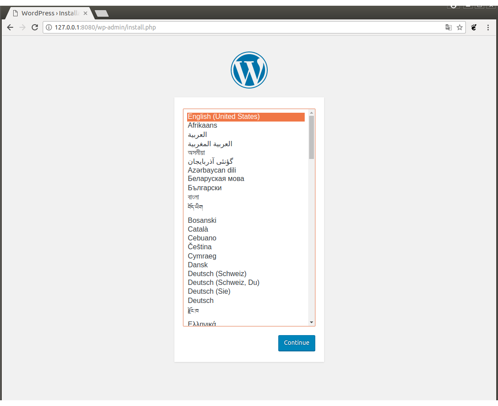
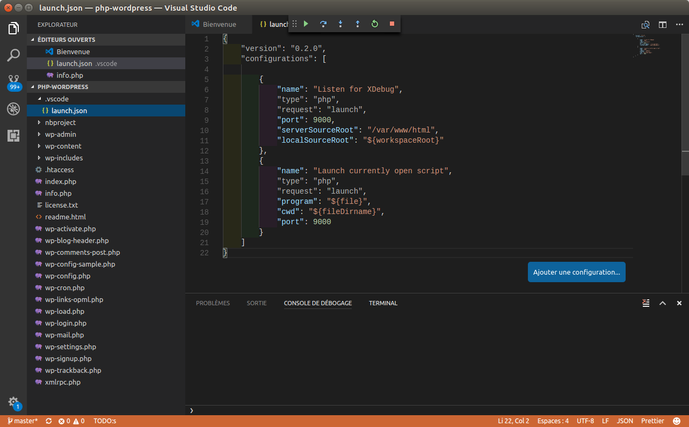

# WordPress.SandBox.XDebug.Docker

Environnement d'intégration WordPress. Persiste la base de données et les plugins dans les répertoires 'db-wordpress' et 'php-wordpress' dans le répertoire courant...

```
git clone 'https://github.com/venantvr/WordPress.SandBox.XDebug.Docker.git
cd WordPress.SandBox.XDebug.Docker
chmod +x wordpress-sandbox.sh
./wordpress-sandbox.sh 

```

```
renald@venantvr:~/wordpress-sandbox$ chmod +x wordpress-sandbox.sh 
renald@venantvr:~/wordpress-sandbox$ ./wordpress-sandbox.sh 
Recreating wordpresssandbox_wordpress_1
Recreating wordpresssandbox_mysql_1
Attaching to wordpresssandbox_mysql_1, wordpresssandbox_wordpress_1
mysql_1      | 2017-09-13T08:10:03.261979Z 0 [Warning] TIMESTAMP with implicit DEFAULT value is deprecated. Please use --explicit_defaults_for_timestamp server option (see documentation for more details).
mysql_1      | 2017-09-13T08:10:03.262848Z 0 [Note] mysqld (mysqld 5.7.19) starting as process 1 ...
mysql_1      | 2017-09-13T08:10:03.264790Z 0 [Note] InnoDB: PUNCH HOLE support available
mysql_1      | 2017-09-13T08:10:03.264803Z 0 [Note] InnoDB: Mutexes and rw_locks use GCC atomic builtins
mysql_1      | 2017-09-13T08:10:03.264806Z 0 [Note] InnoDB: Uses event mutexes
mysql_1      | 2017-09-13T08:10:03.264809Z 0 [Note] InnoDB: GCC builtin __atomic_thread_fence() is used for memory barrier
mysql_1      | 2017-09-13T08:10:03.264831Z 0 [Note] InnoDB: Compressed tables use zlib 1.2.3
mysql_1      | 2017-09-13T08:10:03.264835Z 0 [Note] InnoDB: Using Linux native AIO
mysql_1      | 2017-09-13T08:10:03.264975Z 0 [Note] InnoDB: Number of pools: 1
mysql_1      | 2017-09-13T08:10:03.265086Z 0 [Note] InnoDB: Using CPU crc32 instructions
mysql_1      | 2017-09-13T08:10:03.266026Z 0 [Note] InnoDB: Initializing buffer pool, total size = 128M, instances = 1, chunk size = 128M
mysql_1      | 2017-09-13T08:10:03.270494Z 0 [Note] InnoDB: Completed initialization of buffer pool
mysql_1      | 2017-09-13T08:10:03.271756Z 0 [Note] InnoDB: If the mysqld execution user is authorized, page cleaner thread priority can be changed. See the man page of setpriority().
mysql_1      | 2017-09-13T08:10:03.283967Z 0 [Note] InnoDB: Highest supported file format is Barracuda.
mysql_1      | 2017-09-13T08:10:03.294271Z 0 [Note] InnoDB: Creating shared tablespace for temporary tables
mysql_1      | 2017-09-13T08:10:03.294326Z 0 [Note] InnoDB: Setting file './ibtmp1' size to 12 MB. Physically writing the file full; Please wait ...
mysql_1      | 2017-09-13T08:10:03.325837Z 0 [Note] InnoDB: File './ibtmp1' size is now 12 MB.
mysql_1      | 2017-09-13T08:10:03.327243Z 0 [Note] InnoDB: 96 redo rollback segment(s) found. 96 redo rollback segment(s) are active.
mysql_1      | 2017-09-13T08:10:03.327268Z 0 [Note] InnoDB: 32 non-redo rollback segment(s) are active.
mysql_1      | 2017-09-13T08:10:03.328226Z 0 [Note] InnoDB: 5.7.19 started; log sequence number 16720450
mysql_1      | 2017-09-13T08:10:03.329067Z 0 [Note] InnoDB: Loading buffer pool(s) from /var/lib/mysql/ib_buffer_pool
mysql_1      | 2017-09-13T08:10:03.329408Z 0 [Note] Plugin 'FEDERATED' is disabled.
mysql_1      | 2017-09-13T08:10:03.333334Z 0 [Note] InnoDB: Buffer pool(s) load completed at 170913  8:10:03
mysql_1      | 2017-09-13T08:10:03.335648Z 0 [Note] Found ca.pem, server-cert.pem and server-key.pem in data directory. Trying to enable SSL support using them.
mysql_1      | 2017-09-13T08:10:03.336053Z 0 [Warning] CA certificate ca.pem is self signed.
mysql_1      | 2017-09-13T08:10:03.339687Z 0 [Note] Server hostname (bind-address): '*'; port: 3306
mysql_1      | 2017-09-13T08:10:03.339741Z 0 [Note] IPv6 is available.
mysql_1      | 2017-09-13T08:10:03.339752Z 0 [Note]   - '::' resolves to '::';
mysql_1      | 2017-09-13T08:10:03.339777Z 0 [Note] Server socket created on IP: '::'.
mysql_1      | 2017-09-13T08:10:03.344214Z 0 [Warning] 'user' entry 'root@localhost' ignored in --skip-name-resolve mode.
mysql_1      | 2017-09-13T08:10:03.344272Z 0 [Warning] 'user' entry 'mysql.sys@localhost' ignored in --skip-name-resolve mode.
mysql_1      | 2017-09-13T08:10:03.344303Z 0 [Warning] 'db' entry 'performance_schema mysql.session@localhost' ignored in --skip-name-resolve mode.
mysql_1      | 2017-09-13T08:10:03.344312Z 0 [Warning] 'db' entry 'sys mysql.sys@localhost' ignored in --skip-name-resolve mode.
mysql_1      | 2017-09-13T08:10:03.344329Z 0 [Warning] 'proxies_priv' entry '@ root@localhost' ignored in --skip-name-resolve mode.
mysql_1      | 2017-09-13T08:10:03.349609Z 0 [Warning] 'tables_priv' entry 'user mysql.session@localhost' ignored in --skip-name-resolve mode.
mysql_1      | 2017-09-13T08:10:03.349642Z 0 [Warning] 'tables_priv' entry 'sys_config mysql.sys@localhost' ignored in --skip-name-resolve mode.
mysql_1      | 2017-09-13T08:10:03.360065Z 0 [Note] Event Scheduler: Loaded 0 events
mysql_1      | 2017-09-13T08:10:03.360438Z 0 [Note] mysqld: ready for connections.
mysql_1      | Version: '5.7.19'  socket: '/var/run/mysqld/mysqld.sock'  port: 3306  MySQL Community Server (GPL)
mysql_1      | 2017-09-13T08:10:03.360466Z 0 [Note] Executing 'SELECT * FROM INFORMATION_SCHEMA.TABLES;' to get a list of tables using the deprecated partition engine. You may use the startup option '--disable-partition-engine-check' to skip this check. 
mysql_1      | 2017-09-13T08:10:03.360472Z 0 [Note] Beginning of list of non-natively partitioned tables
mysql_1      | 2017-09-13T08:10:03.381571Z 0 [Note] End of list of non-natively partitioned tables
wordpress_1  | downloading xdebug-2.5.5.tgz ...
wordpress_1  | Starting to download xdebug-2.5.5.tgz (279,491 bytes)
wordpress_1  | .........done: 279,491 bytes
wordpress_1  | 76 source files, building
wordpress_1  | running: phpize
wordpress_1  | Configuring for:
wordpress_1  | PHP Api Version:         20131106
wordpress_1  | Zend Module Api No:      20131226
wordpress_1  | Zend Extension Api No:   220131226
wordpress_1  | building in /tmp/pear/temp/pear-build-defaultuserBbc3nL/xdebug-2.5.5
wordpress_1  | running: /tmp/pear/temp/xdebug/configure --with-php-config=/usr/local/bin/php-config
wordpress_1  | checking for grep that handles long lines and -e... /bin/grep
wordpress_1  | checking for egrep... /bin/grep -E
wordpress_1  | checking for a sed that does not truncate output... /bin/sed
wordpress_1  | checking for cc... cc
wordpress_1  | checking whether the C compiler works... yes
wordpress_1  | checking for C compiler default output file name... a.out
wordpress_1  | checking for suffix of executables...
wordpress_1  | checking whether we are cross compiling... no
wordpress_1  | checking for suffix of object files... o
wordpress_1  | checking whether we are using the GNU C compiler... yes
wordpress_1  | checking whether cc accepts -g... yes
wordpress_1  | checking for cc option to accept ISO C89... none needed
wordpress_1  | checking how to run the C preprocessor... cc -E
wordpress_1  | checking for icc... no
wordpress_1  | checking for suncc... no
wordpress_1  | checking whether cc understands -c and -o together... yes
wordpress_1  | checking for system library directory... lib
wordpress_1  | checking if compiler supports -R... no
wordpress_1  | checking if compiler supports -Wl,-rpath,... yes
wordpress_1  | checking build system type... x86_64-unknown-linux-gnu
wordpress_1  | checking host system type... x86_64-unknown-linux-gnu
wordpress_1  | checking target system type... x86_64-unknown-linux-gnu
wordpress_1  | checking for PHP prefix... /usr/local
wordpress_1  | checking for PHP includes... -I/usr/local/include/php -I/usr/local/include/php/main -I/usr/local/include/php/TSRM -I/usr/local/include/php/Zend -I/usr/local/include/php/ext -I/usr/local/include/php/ext/date/lib
wordpress_1  | checking for PHP extension directory... /usr/local/lib/php/extensions/no-debug-non-zts-20131226
wordpress_1  | checking for PHP installed headers prefix... /usr/local/include/php
wordpress_1  | checking if debug is enabled... no
wordpress_1  | checking if zts is enabled... no
wordpress_1  | checking for re2c... re2c
wordpress_1  | checking for re2c version... 0.13.5 (ok)
wordpress_1  | checking for gawk... no
wordpress_1  | checking for nawk... nawk
wordpress_1  | checking if nawk is broken... no
wordpress_1  | checking whether to enable Xdebug support... yes, shared
wordpress_1  | checking Check for supported PHP versions... supported (5.6.31)
wordpress_1  | checking for gettimeofday... yes
wordpress_1  | checking for ANSI C header files... yes
wordpress_1  | checking for sys/types.h... yes
wordpress_1  | checking for sys/stat.h... yes
wordpress_1  | checking for stdlib.h... yes
wordpress_1  | checking for string.h... yes
wordpress_1  | checking for memory.h... yes
wordpress_1  | checking for strings.h... yes
wordpress_1  | checking for inttypes.h... yes
wordpress_1  | checking for stdint.h... yes
wordpress_1  | checking for unistd.h... yes
wordpress_1  | checking netinet/in.h usability... yes
wordpress_1  | checking netinet/in.h presence... yes
wordpress_1  | checking for netinet/in.h... yes
wordpress_1  | checking for cos in -lm... yes
wordpress_1  | checking for ld used by cc... /usr/bin/ld
wordpress_1  | checking if the linker (/usr/bin/ld) is GNU ld... yes
wordpress_1  | checking for /usr/bin/ld option to reload object files... -r
wordpress_1  | checking for BSD-compatible nm... /usr/bin/nm -B
wordpress_1  | checking whether ln -s works... yes
wordpress_1  | checking how to recognize dependent libraries... pass_all
wordpress_1  | checking dlfcn.h usability... yes
wordpress_1  | checking dlfcn.h presence... yes
wordpress_1  | checking for dlfcn.h... yes
wordpress_1  | checking the maximum length of command line arguments... 1572864
wordpress_1  | checking command to parse /usr/bin/nm -B output from cc object... ok
wordpress_1  | checking for objdir... .libs
wordpress_1  | checking for ar... ar
wordpress_1  | checking for ranlib... ranlib
wordpress_1  | checking for strip... strip
wordpress_1  | checking if cc supports -fno-rtti -fno-exceptions... no
wordpress_1  | checking for cc option to produce PIC... -fPIC
wordpress_1  | checking if cc PIC flag -fPIC works... yes
wordpress_1  | checking if cc static flag -static works... yes
wordpress_1  | checking if cc supports -c -o file.o... yes
wordpress_1  | checking whether the cc linker (/usr/bin/ld -m elf_x86_64) supports shared libraries... yes
wordpress_1  | checking whether -lc should be explicitly linked in... no
wordpress_1  | checking dynamic linker characteristics... GNU/Linux ld.so
wordpress_1  | checking how to hardcode library paths into programs... immediate
wordpress_1  | checking whether stripping libraries is possible... yes
wordpress_1  | checking if libtool supports shared libraries... yes
wordpress_1  | checking whether to build shared libraries... yes
wordpress_1  | checking whether to build static libraries... no
wordpress_1  | 
wordpress_1  | creating libtool
wordpress_1  | appending configuration tag "CXX" to libtool
wordpress_1  | configure: creating ./config.status
wordpress_1  | config.status: creating config.h
wordpress_1  | running: make
wordpress_1  | /bin/bash /tmp/pear/temp/pear-build-defaultuserBbc3nL/xdebug-2.5.5/libtool --mode=compile cc  -I. -I/tmp/pear/temp/xdebug -DPHP_ATOM_INC -I/tmp/pear/temp/pear-build-defaultuserBbc3nL/xdebug-2.5.5/include -I/tmp/pear/temp/pear-build-defaultuserBbc3nL/xdebug-2.5.5/main -I/tmp/pear/temp/xdebug -I/usr/local/include/php -I/usr/local/include/php/main -I/usr/local/include/php/TSRM -I/usr/local/include/php/Zend -I/usr/local/include/php/ext -I/usr/local/include/php/ext/date/lib  -DHAVE_CONFIG_H  -g -O2   -c /tmp/pear/temp/xdebug/xdebug.c -o xdebug.lo
wordpress_1  | mkdir .libs
wordpress_1  |  cc -I. -I/tmp/pear/temp/xdebug -DPHP_ATOM_INC -I/tmp/pear/temp/pear-build-defaultuserBbc3nL/xdebug-2.5.5/include -I/tmp/pear/temp/pear-build-defaultuserBbc3nL/xdebug-2.5.5/main -I/tmp/pear/temp/xdebug -I/usr/local/include/php -I/usr/local/include/php/main -I/usr/local/include/php/TSRM -I/usr/local/include/php/Zend -I/usr/local/include/php/ext -I/usr/local/include/php/ext/date/lib -DHAVE_CONFIG_H -g -O2 -c /tmp/pear/temp/xdebug/xdebug.c  -fPIC -DPIC -o .libs/xdebug.o
wordpress_1  | /bin/bash /tmp/pear/temp/pear-build-defaultuserBbc3nL/xdebug-2.5.5/libtool --mode=compile cc  -I. -I/tmp/pear/temp/xdebug -DPHP_ATOM_INC -I/tmp/pear/temp/pear-build-defaultuserBbc3nL/xdebug-2.5.5/include -I/tmp/pear/temp/pear-build-defaultuserBbc3nL/xdebug-2.5.5/main -I/tmp/pear/temp/xdebug -I/usr/local/include/php -I/usr/local/include/php/main -I/usr/local/include/php/TSRM -I/usr/local/include/php/Zend -I/usr/local/include/php/ext -I/usr/local/include/php/ext/date/lib  -DHAVE_CONFIG_H  -g -O2   -c /tmp/pear/temp/xdebug/xdebug_branch_info.c -o xdebug_branch_info.lo
wordpress_1  |  cc -I. -I/tmp/pear/temp/xdebug -DPHP_ATOM_INC -I/tmp/pear/temp/pear-build-defaultuserBbc3nL/xdebug-2.5.5/include -I/tmp/pear/temp/pear-build-defaultuserBbc3nL/xdebug-2.5.5/main -I/tmp/pear/temp/xdebug -I/usr/local/include/php -I/usr/local/include/php/main -I/usr/local/include/php/TSRM -I/usr/local/include/php/Zend -I/usr/local/include/php/ext -I/usr/local/include/php/ext/date/lib -DHAVE_CONFIG_H -g -O2 -c /tmp/pear/temp/xdebug/xdebug_branch_info.c  -fPIC -DPIC -o .libs/xdebug_branch_info.o
wordpress_1  | /bin/bash /tmp/pear/temp/pear-build-defaultuserBbc3nL/xdebug-2.5.5/libtool --mode=compile cc  -I. -I/tmp/pear/temp/xdebug -DPHP_ATOM_INC -I/tmp/pear/temp/pear-build-defaultuserBbc3nL/xdebug-2.5.5/include -I/tmp/pear/temp/pear-build-defaultuserBbc3nL/xdebug-2.5.5/main -I/tmp/pear/temp/xdebug -I/usr/local/include/php -I/usr/local/include/php/main -I/usr/local/include/php/TSRM -I/usr/local/include/php/Zend -I/usr/local/include/php/ext -I/usr/local/include/php/ext/date/lib  -DHAVE_CONFIG_H  -g -O2   -c /tmp/pear/temp/xdebug/xdebug_code_coverage.c -o xdebug_code_coverage.lo
wordpress_1  |  cc -I. -I/tmp/pear/temp/xdebug -DPHP_ATOM_INC -I/tmp/pear/temp/pear-build-defaultuserBbc3nL/xdebug-2.5.5/include -I/tmp/pear/temp/pear-build-defaultuserBbc3nL/xdebug-2.5.5/main -I/tmp/pear/temp/xdebug -I/usr/local/include/php -I/usr/local/include/php/main -I/usr/local/include/php/TSRM -I/usr/local/include/php/Zend -I/usr/local/include/php/ext -I/usr/local/include/php/ext/date/lib -DHAVE_CONFIG_H -g -O2 -c /tmp/pear/temp/xdebug/xdebug_code_coverage.c  -fPIC -DPIC -o .libs/xdebug_code_coverage.o
wordpress_1  | /bin/bash /tmp/pear/temp/pear-build-defaultuserBbc3nL/xdebug-2.5.5/libtool --mode=compile cc  -I. -I/tmp/pear/temp/xdebug -DPHP_ATOM_INC -I/tmp/pear/temp/pear-build-defaultuserBbc3nL/xdebug-2.5.5/include -I/tmp/pear/temp/pear-build-defaultuserBbc3nL/xdebug-2.5.5/main -I/tmp/pear/temp/xdebug -I/usr/local/include/php -I/usr/local/include/php/main -I/usr/local/include/php/TSRM -I/usr/local/include/php/Zend -I/usr/local/include/php/ext -I/usr/local/include/php/ext/date/lib  -DHAVE_CONFIG_H  -g -O2   -c /tmp/pear/temp/xdebug/xdebug_com.c -o xdebug_com.lo
wordpress_1  |  cc -I. -I/tmp/pear/temp/xdebug -DPHP_ATOM_INC -I/tmp/pear/temp/pear-build-defaultuserBbc3nL/xdebug-2.5.5/include -I/tmp/pear/temp/pear-build-defaultuserBbc3nL/xdebug-2.5.5/main -I/tmp/pear/temp/xdebug -I/usr/local/include/php -I/usr/local/include/php/main -I/usr/local/include/php/TSRM -I/usr/local/include/php/Zend -I/usr/local/include/php/ext -I/usr/local/include/php/ext/date/lib -DHAVE_CONFIG_H -g -O2 -c /tmp/pear/temp/xdebug/xdebug_com.c  -fPIC -DPIC -o .libs/xdebug_com.o
wordpress_1  | /bin/bash /tmp/pear/temp/pear-build-defaultuserBbc3nL/xdebug-2.5.5/libtool --mode=compile cc  -I. -I/tmp/pear/temp/xdebug -DPHP_ATOM_INC -I/tmp/pear/temp/pear-build-defaultuserBbc3nL/xdebug-2.5.5/include -I/tmp/pear/temp/pear-build-defaultuserBbc3nL/xdebug-2.5.5/main -I/tmp/pear/temp/xdebug -I/usr/local/include/php -I/usr/local/include/php/main -I/usr/local/include/php/TSRM -I/usr/local/include/php/Zend -I/usr/local/include/php/ext -I/usr/local/include/php/ext/date/lib  -DHAVE_CONFIG_H  -g -O2   -c /tmp/pear/temp/xdebug/xdebug_compat.c -o xdebug_compat.lo
wordpress_1  |  cc -I. -I/tmp/pear/temp/xdebug -DPHP_ATOM_INC -I/tmp/pear/temp/pear-build-defaultuserBbc3nL/xdebug-2.5.5/include -I/tmp/pear/temp/pear-build-defaultuserBbc3nL/xdebug-2.5.5/main -I/tmp/pear/temp/xdebug -I/usr/local/include/php -I/usr/local/include/php/main -I/usr/local/include/php/TSRM -I/usr/local/include/php/Zend -I/usr/local/include/php/ext -I/usr/local/include/php/ext/date/lib -DHAVE_CONFIG_H -g -O2 -c /tmp/pear/temp/xdebug/xdebug_compat.c  -fPIC -DPIC -o .libs/xdebug_compat.o
wordpress_1  | /bin/bash /tmp/pear/temp/pear-build-defaultuserBbc3nL/xdebug-2.5.5/libtool --mode=compile cc  -I. -I/tmp/pear/temp/xdebug -DPHP_ATOM_INC -I/tmp/pear/temp/pear-build-defaultuserBbc3nL/xdebug-2.5.5/include -I/tmp/pear/temp/pear-build-defaultuserBbc3nL/xdebug-2.5.5/main -I/tmp/pear/temp/xdebug -I/usr/local/include/php -I/usr/local/include/php/main -I/usr/local/include/php/TSRM -I/usr/local/include/php/Zend -I/usr/local/include/php/ext -I/usr/local/include/php/ext/date/lib  -DHAVE_CONFIG_H  -g -O2   -c /tmp/pear/temp/xdebug/xdebug_handler_dbgp.c -o xdebug_handler_dbgp.lo
wordpress_1  |  cc -I. -I/tmp/pear/temp/xdebug -DPHP_ATOM_INC -I/tmp/pear/temp/pear-build-defaultuserBbc3nL/xdebug-2.5.5/include -I/tmp/pear/temp/pear-build-defaultuserBbc3nL/xdebug-2.5.5/main -I/tmp/pear/temp/xdebug -I/usr/local/include/php -I/usr/local/include/php/main -I/usr/local/include/php/TSRM -I/usr/local/include/php/Zend -I/usr/local/include/php/ext -I/usr/local/include/php/ext/date/lib -DHAVE_CONFIG_H -g -O2 -c /tmp/pear/temp/xdebug/xdebug_handler_dbgp.c  -fPIC -DPIC -o .libs/xdebug_handler_dbgp.o
wordpress_1  | /bin/bash /tmp/pear/temp/pear-build-defaultuserBbc3nL/xdebug-2.5.5/libtool --mode=compile cc  -I. -I/tmp/pear/temp/xdebug -DPHP_ATOM_INC -I/tmp/pear/temp/pear-build-defaultuserBbc3nL/xdebug-2.5.5/include -I/tmp/pear/temp/pear-build-defaultuserBbc3nL/xdebug-2.5.5/main -I/tmp/pear/temp/xdebug -I/usr/local/include/php -I/usr/local/include/php/main -I/usr/local/include/php/TSRM -I/usr/local/include/php/Zend -I/usr/local/include/php/ext -I/usr/local/include/php/ext/date/lib  -DHAVE_CONFIG_H  -g -O2   -c /tmp/pear/temp/xdebug/xdebug_handlers.c -o xdebug_handlers.lo
wordpress_1  |  cc -I. -I/tmp/pear/temp/xdebug -DPHP_ATOM_INC -I/tmp/pear/temp/pear-build-defaultuserBbc3nL/xdebug-2.5.5/include -I/tmp/pear/temp/pear-build-defaultuserBbc3nL/xdebug-2.5.5/main -I/tmp/pear/temp/xdebug -I/usr/local/include/php -I/usr/local/include/php/main -I/usr/local/include/php/TSRM -I/usr/local/include/php/Zend -I/usr/local/include/php/ext -I/usr/local/include/php/ext/date/lib -DHAVE_CONFIG_H -g -O2 -c /tmp/pear/temp/xdebug/xdebug_handlers.c  -fPIC -DPIC -o .libs/xdebug_handlers.o
wordpress_1  | /bin/bash /tmp/pear/temp/pear-build-defaultuserBbc3nL/xdebug-2.5.5/libtool --mode=compile cc  -I. -I/tmp/pear/temp/xdebug -DPHP_ATOM_INC -I/tmp/pear/temp/pear-build-defaultuserBbc3nL/xdebug-2.5.5/include -I/tmp/pear/temp/pear-build-defaultuserBbc3nL/xdebug-2.5.5/main -I/tmp/pear/temp/xdebug -I/usr/local/include/php -I/usr/local/include/php/main -I/usr/local/include/php/TSRM -I/usr/local/include/php/Zend -I/usr/local/include/php/ext -I/usr/local/include/php/ext/date/lib  -DHAVE_CONFIG_H  -g -O2   -c /tmp/pear/temp/xdebug/xdebug_llist.c -o xdebug_llist.lo
wordpress_1  |  cc -I. -I/tmp/pear/temp/xdebug -DPHP_ATOM_INC -I/tmp/pear/temp/pear-build-defaultuserBbc3nL/xdebug-2.5.5/include -I/tmp/pear/temp/pear-build-defaultuserBbc3nL/xdebug-2.5.5/main -I/tmp/pear/temp/xdebug -I/usr/local/include/php -I/usr/local/include/php/main -I/usr/local/include/php/TSRM -I/usr/local/include/php/Zend -I/usr/local/include/php/ext -I/usr/local/include/php/ext/date/lib -DHAVE_CONFIG_H -g -O2 -c /tmp/pear/temp/xdebug/xdebug_llist.c  -fPIC -DPIC -o .libs/xdebug_llist.o
wordpress_1  | /bin/bash /tmp/pear/temp/pear-build-defaultuserBbc3nL/xdebug-2.5.5/libtool --mode=compile cc  -I. -I/tmp/pear/temp/xdebug -DPHP_ATOM_INC -I/tmp/pear/temp/pear-build-defaultuserBbc3nL/xdebug-2.5.5/include -I/tmp/pear/temp/pear-build-defaultuserBbc3nL/xdebug-2.5.5/main -I/tmp/pear/temp/xdebug -I/usr/local/include/php -I/usr/local/include/php/main -I/usr/local/include/php/TSRM -I/usr/local/include/php/Zend -I/usr/local/include/php/ext -I/usr/local/include/php/ext/date/lib  -DHAVE_CONFIG_H  -g -O2   -c /tmp/pear/temp/xdebug/xdebug_monitor.c -o xdebug_monitor.lo
wordpress_1  |  cc -I. -I/tmp/pear/temp/xdebug -DPHP_ATOM_INC -I/tmp/pear/temp/pear-build-defaultuserBbc3nL/xdebug-2.5.5/include -I/tmp/pear/temp/pear-build-defaultuserBbc3nL/xdebug-2.5.5/main -I/tmp/pear/temp/xdebug -I/usr/local/include/php -I/usr/local/include/php/main -I/usr/local/include/php/TSRM -I/usr/local/include/php/Zend -I/usr/local/include/php/ext -I/usr/local/include/php/ext/date/lib -DHAVE_CONFIG_H -g -O2 -c /tmp/pear/temp/xdebug/xdebug_monitor.c  -fPIC -DPIC -o .libs/xdebug_monitor.o
wordpress_1  | /bin/bash /tmp/pear/temp/pear-build-defaultuserBbc3nL/xdebug-2.5.5/libtool --mode=compile cc  -I. -I/tmp/pear/temp/xdebug -DPHP_ATOM_INC -I/tmp/pear/temp/pear-build-defaultuserBbc3nL/xdebug-2.5.5/include -I/tmp/pear/temp/pear-build-defaultuserBbc3nL/xdebug-2.5.5/main -I/tmp/pear/temp/xdebug -I/usr/local/include/php -I/usr/local/include/php/main -I/usr/local/include/php/TSRM -I/usr/local/include/php/Zend -I/usr/local/include/php/ext -I/usr/local/include/php/ext/date/lib  -DHAVE_CONFIG_H  -g -O2   -c /tmp/pear/temp/xdebug/xdebug_hash.c -o xdebug_hash.lo
wordpress_1  |  cc -I. -I/tmp/pear/temp/xdebug -DPHP_ATOM_INC -I/tmp/pear/temp/pear-build-defaultuserBbc3nL/xdebug-2.5.5/include -I/tmp/pear/temp/pear-build-defaultuserBbc3nL/xdebug-2.5.5/main -I/tmp/pear/temp/xdebug -I/usr/local/include/php -I/usr/local/include/php/main -I/usr/local/include/php/TSRM -I/usr/local/include/php/Zend -I/usr/local/include/php/ext -I/usr/local/include/php/ext/date/lib -DHAVE_CONFIG_H -g -O2 -c /tmp/pear/temp/xdebug/xdebug_hash.c  -fPIC -DPIC -o .libs/xdebug_hash.o
wordpress_1  | /bin/bash /tmp/pear/temp/pear-build-defaultuserBbc3nL/xdebug-2.5.5/libtool --mode=compile cc  -I. -I/tmp/pear/temp/xdebug -DPHP_ATOM_INC -I/tmp/pear/temp/pear-build-defaultuserBbc3nL/xdebug-2.5.5/include -I/tmp/pear/temp/pear-build-defaultuserBbc3nL/xdebug-2.5.5/main -I/tmp/pear/temp/xdebug -I/usr/local/include/php -I/usr/local/include/php/main -I/usr/local/include/php/TSRM -I/usr/local/include/php/Zend -I/usr/local/include/php/ext -I/usr/local/include/php/ext/date/lib  -DHAVE_CONFIG_H  -g -O2   -c /tmp/pear/temp/xdebug/xdebug_private.c -o xdebug_private.lo
wordpress_1  |  cc -I. -I/tmp/pear/temp/xdebug -DPHP_ATOM_INC -I/tmp/pear/temp/pear-build-defaultuserBbc3nL/xdebug-2.5.5/include -I/tmp/pear/temp/pear-build-defaultuserBbc3nL/xdebug-2.5.5/main -I/tmp/pear/temp/xdebug -I/usr/local/include/php -I/usr/local/include/php/main -I/usr/local/include/php/TSRM -I/usr/local/include/php/Zend -I/usr/local/include/php/ext -I/usr/local/include/php/ext/date/lib -DHAVE_CONFIG_H -g -O2 -c /tmp/pear/temp/xdebug/xdebug_private.c  -fPIC -DPIC -o .libs/xdebug_private.o
wordpress_1  | /bin/bash /tmp/pear/temp/pear-build-defaultuserBbc3nL/xdebug-2.5.5/libtool --mode=compile cc  -I. -I/tmp/pear/temp/xdebug -DPHP_ATOM_INC -I/tmp/pear/temp/pear-build-defaultuserBbc3nL/xdebug-2.5.5/include -I/tmp/pear/temp/pear-build-defaultuserBbc3nL/xdebug-2.5.5/main -I/tmp/pear/temp/xdebug -I/usr/local/include/php -I/usr/local/include/php/main -I/usr/local/include/php/TSRM -I/usr/local/include/php/Zend -I/usr/local/include/php/ext -I/usr/local/include/php/ext/date/lib  -DHAVE_CONFIG_H  -g -O2   -c /tmp/pear/temp/xdebug/xdebug_profiler.c -o xdebug_profiler.lo
wordpress_1  |  cc -I. -I/tmp/pear/temp/xdebug -DPHP_ATOM_INC -I/tmp/pear/temp/pear-build-defaultuserBbc3nL/xdebug-2.5.5/include -I/tmp/pear/temp/pear-build-defaultuserBbc3nL/xdebug-2.5.5/main -I/tmp/pear/temp/xdebug -I/usr/local/include/php -I/usr/local/include/php/main -I/usr/local/include/php/TSRM -I/usr/local/include/php/Zend -I/usr/local/include/php/ext -I/usr/local/include/php/ext/date/lib -DHAVE_CONFIG_H -g -O2 -c /tmp/pear/temp/xdebug/xdebug_profiler.c  -fPIC -DPIC -o .libs/xdebug_profiler.o
wordpress_1  | /bin/bash /tmp/pear/temp/pear-build-defaultuserBbc3nL/xdebug-2.5.5/libtool --mode=compile cc  -I. -I/tmp/pear/temp/xdebug -DPHP_ATOM_INC -I/tmp/pear/temp/pear-build-defaultuserBbc3nL/xdebug-2.5.5/include -I/tmp/pear/temp/pear-build-defaultuserBbc3nL/xdebug-2.5.5/main -I/tmp/pear/temp/xdebug -I/usr/local/include/php -I/usr/local/include/php/main -I/usr/local/include/php/TSRM -I/usr/local/include/php/Zend -I/usr/local/include/php/ext -I/usr/local/include/php/ext/date/lib  -DHAVE_CONFIG_H  -g -O2   -c /tmp/pear/temp/xdebug/xdebug_set.c -o xdebug_set.lo
wordpress_1  |  cc -I. -I/tmp/pear/temp/xdebug -DPHP_ATOM_INC -I/tmp/pear/temp/pear-build-defaultuserBbc3nL/xdebug-2.5.5/include -I/tmp/pear/temp/pear-build-defaultuserBbc3nL/xdebug-2.5.5/main -I/tmp/pear/temp/xdebug -I/usr/local/include/php -I/usr/local/include/php/main -I/usr/local/include/php/TSRM -I/usr/local/include/php/Zend -I/usr/local/include/php/ext -I/usr/local/include/php/ext/date/lib -DHAVE_CONFIG_H -g -O2 -c /tmp/pear/temp/xdebug/xdebug_set.c  -fPIC -DPIC -o .libs/xdebug_set.o
wordpress_1  | /bin/bash /tmp/pear/temp/pear-build-defaultuserBbc3nL/xdebug-2.5.5/libtool --mode=compile cc  -I. -I/tmp/pear/temp/xdebug -DPHP_ATOM_INC -I/tmp/pear/temp/pear-build-defaultuserBbc3nL/xdebug-2.5.5/include -I/tmp/pear/temp/pear-build-defaultuserBbc3nL/xdebug-2.5.5/main -I/tmp/pear/temp/xdebug -I/usr/local/include/php -I/usr/local/include/php/main -I/usr/local/include/php/TSRM -I/usr/local/include/php/Zend -I/usr/local/include/php/ext -I/usr/local/include/php/ext/date/lib  -DHAVE_CONFIG_H  -g -O2   -c /tmp/pear/temp/xdebug/xdebug_stack.c -o xdebug_stack.lo
wordpress_1  |  cc -I. -I/tmp/pear/temp/xdebug -DPHP_ATOM_INC -I/tmp/pear/temp/pear-build-defaultuserBbc3nL/xdebug-2.5.5/include -I/tmp/pear/temp/pear-build-defaultuserBbc3nL/xdebug-2.5.5/main -I/tmp/pear/temp/xdebug -I/usr/local/include/php -I/usr/local/include/php/main -I/usr/local/include/php/TSRM -I/usr/local/include/php/Zend -I/usr/local/include/php/ext -I/usr/local/include/php/ext/date/lib -DHAVE_CONFIG_H -g -O2 -c /tmp/pear/temp/xdebug/xdebug_stack.c  -fPIC -DPIC -o .libs/xdebug_stack.o
wordpress_1  | /bin/bash /tmp/pear/temp/pear-build-defaultuserBbc3nL/xdebug-2.5.5/libtool --mode=compile cc  -I. -I/tmp/pear/temp/xdebug -DPHP_ATOM_INC -I/tmp/pear/temp/pear-build-defaultuserBbc3nL/xdebug-2.5.5/include -I/tmp/pear/temp/pear-build-defaultuserBbc3nL/xdebug-2.5.5/main -I/tmp/pear/temp/xdebug -I/usr/local/include/php -I/usr/local/include/php/main -I/usr/local/include/php/TSRM -I/usr/local/include/php/Zend -I/usr/local/include/php/ext -I/usr/local/include/php/ext/date/lib  -DHAVE_CONFIG_H  -g -O2   -c /tmp/pear/temp/xdebug/xdebug_str.c -o xdebug_str.lo
wordpress_1  |  cc -I. -I/tmp/pear/temp/xdebug -DPHP_ATOM_INC -I/tmp/pear/temp/pear-build-defaultuserBbc3nL/xdebug-2.5.5/include -I/tmp/pear/temp/pear-build-defaultuserBbc3nL/xdebug-2.5.5/main -I/tmp/pear/temp/xdebug -I/usr/local/include/php -I/usr/local/include/php/main -I/usr/local/include/php/TSRM -I/usr/local/include/php/Zend -I/usr/local/include/php/ext -I/usr/local/include/php/ext/date/lib -DHAVE_CONFIG_H -g -O2 -c /tmp/pear/temp/xdebug/xdebug_str.c  -fPIC -DPIC -o .libs/xdebug_str.o
wordpress_1  | /bin/bash /tmp/pear/temp/pear-build-defaultuserBbc3nL/xdebug-2.5.5/libtool --mode=compile cc  -I. -I/tmp/pear/temp/xdebug -DPHP_ATOM_INC -I/tmp/pear/temp/pear-build-defaultuserBbc3nL/xdebug-2.5.5/include -I/tmp/pear/temp/pear-build-defaultuserBbc3nL/xdebug-2.5.5/main -I/tmp/pear/temp/xdebug -I/usr/local/include/php -I/usr/local/include/php/main -I/usr/local/include/php/TSRM -I/usr/local/include/php/Zend -I/usr/local/include/php/ext -I/usr/local/include/php/ext/date/lib  -DHAVE_CONFIG_H  -g -O2   -c /tmp/pear/temp/xdebug/xdebug_superglobals.c -o xdebug_superglobals.lo
wordpress_1  |  cc -I. -I/tmp/pear/temp/xdebug -DPHP_ATOM_INC -I/tmp/pear/temp/pear-build-defaultuserBbc3nL/xdebug-2.5.5/include -I/tmp/pear/temp/pear-build-defaultuserBbc3nL/xdebug-2.5.5/main -I/tmp/pear/temp/xdebug -I/usr/local/include/php -I/usr/local/include/php/main -I/usr/local/include/php/TSRM -I/usr/local/include/php/Zend -I/usr/local/include/php/ext -I/usr/local/include/php/ext/date/lib -DHAVE_CONFIG_H -g -O2 -c /tmp/pear/temp/xdebug/xdebug_superglobals.c  -fPIC -DPIC -o .libs/xdebug_superglobals.o
wordpress_1  | /bin/bash /tmp/pear/temp/pear-build-defaultuserBbc3nL/xdebug-2.5.5/libtool --mode=compile cc  -I. -I/tmp/pear/temp/xdebug -DPHP_ATOM_INC -I/tmp/pear/temp/pear-build-defaultuserBbc3nL/xdebug-2.5.5/include -I/tmp/pear/temp/pear-build-defaultuserBbc3nL/xdebug-2.5.5/main -I/tmp/pear/temp/xdebug -I/usr/local/include/php -I/usr/local/include/php/main -I/usr/local/include/php/TSRM -I/usr/local/include/php/Zend -I/usr/local/include/php/ext -I/usr/local/include/php/ext/date/lib  -DHAVE_CONFIG_H  -g -O2   -c /tmp/pear/temp/xdebug/xdebug_tracing.c -o xdebug_tracing.lo
wordpress_1  |  cc -I. -I/tmp/pear/temp/xdebug -DPHP_ATOM_INC -I/tmp/pear/temp/pear-build-defaultuserBbc3nL/xdebug-2.5.5/include -I/tmp/pear/temp/pear-build-defaultuserBbc3nL/xdebug-2.5.5/main -I/tmp/pear/temp/xdebug -I/usr/local/include/php -I/usr/local/include/php/main -I/usr/local/include/php/TSRM -I/usr/local/include/php/Zend -I/usr/local/include/php/ext -I/usr/local/include/php/ext/date/lib -DHAVE_CONFIG_H -g -O2 -c /tmp/pear/temp/xdebug/xdebug_tracing.c  -fPIC -DPIC -o .libs/xdebug_tracing.o
wordpress_1  | /bin/bash /tmp/pear/temp/pear-build-defaultuserBbc3nL/xdebug-2.5.5/libtool --mode=compile cc  -I. -I/tmp/pear/temp/xdebug -DPHP_ATOM_INC -I/tmp/pear/temp/pear-build-defaultuserBbc3nL/xdebug-2.5.5/include -I/tmp/pear/temp/pear-build-defaultuserBbc3nL/xdebug-2.5.5/main -I/tmp/pear/temp/xdebug -I/usr/local/include/php -I/usr/local/include/php/main -I/usr/local/include/php/TSRM -I/usr/local/include/php/Zend -I/usr/local/include/php/ext -I/usr/local/include/php/ext/date/lib  -DHAVE_CONFIG_H  -g -O2   -c /tmp/pear/temp/xdebug/xdebug_trace_textual.c -o xdebug_trace_textual.lo
wordpress_1  |  cc -I. -I/tmp/pear/temp/xdebug -DPHP_ATOM_INC -I/tmp/pear/temp/pear-build-defaultuserBbc3nL/xdebug-2.5.5/include -I/tmp/pear/temp/pear-build-defaultuserBbc3nL/xdebug-2.5.5/main -I/tmp/pear/temp/xdebug -I/usr/local/include/php -I/usr/local/include/php/main -I/usr/local/include/php/TSRM -I/usr/local/include/php/Zend -I/usr/local/include/php/ext -I/usr/local/include/php/ext/date/lib -DHAVE_CONFIG_H -g -O2 -c /tmp/pear/temp/xdebug/xdebug_trace_textual.c  -fPIC -DPIC -o .libs/xdebug_trace_textual.o
wordpress_1  | /bin/bash /tmp/pear/temp/pear-build-defaultuserBbc3nL/xdebug-2.5.5/libtool --mode=compile cc  -I. -I/tmp/pear/temp/xdebug -DPHP_ATOM_INC -I/tmp/pear/temp/pear-build-defaultuserBbc3nL/xdebug-2.5.5/include -I/tmp/pear/temp/pear-build-defaultuserBbc3nL/xdebug-2.5.5/main -I/tmp/pear/temp/xdebug -I/usr/local/include/php -I/usr/local/include/php/main -I/usr/local/include/php/TSRM -I/usr/local/include/php/Zend -I/usr/local/include/php/ext -I/usr/local/include/php/ext/date/lib  -DHAVE_CONFIG_H  -g -O2   -c /tmp/pear/temp/xdebug/xdebug_trace_computerized.c -o xdebug_trace_computerized.lo
wordpress_1  |  cc -I. -I/tmp/pear/temp/xdebug -DPHP_ATOM_INC -I/tmp/pear/temp/pear-build-defaultuserBbc3nL/xdebug-2.5.5/include -I/tmp/pear/temp/pear-build-defaultuserBbc3nL/xdebug-2.5.5/main -I/tmp/pear/temp/xdebug -I/usr/local/include/php -I/usr/local/include/php/main -I/usr/local/include/php/TSRM -I/usr/local/include/php/Zend -I/usr/local/include/php/ext -I/usr/local/include/php/ext/date/lib -DHAVE_CONFIG_H -g -O2 -c /tmp/pear/temp/xdebug/xdebug_trace_computerized.c  -fPIC -DPIC -o .libs/xdebug_trace_computerized.o
wordpress_1  | /bin/bash /tmp/pear/temp/pear-build-defaultuserBbc3nL/xdebug-2.5.5/libtool --mode=compile cc  -I. -I/tmp/pear/temp/xdebug -DPHP_ATOM_INC -I/tmp/pear/temp/pear-build-defaultuserBbc3nL/xdebug-2.5.5/include -I/tmp/pear/temp/pear-build-defaultuserBbc3nL/xdebug-2.5.5/main -I/tmp/pear/temp/xdebug -I/usr/local/include/php -I/usr/local/include/php/main -I/usr/local/include/php/TSRM -I/usr/local/include/php/Zend -I/usr/local/include/php/ext -I/usr/local/include/php/ext/date/lib  -DHAVE_CONFIG_H  -g -O2   -c /tmp/pear/temp/xdebug/xdebug_trace_html.c -o xdebug_trace_html.lo
wordpress_1  |  cc -I. -I/tmp/pear/temp/xdebug -DPHP_ATOM_INC -I/tmp/pear/temp/pear-build-defaultuserBbc3nL/xdebug-2.5.5/include -I/tmp/pear/temp/pear-build-defaultuserBbc3nL/xdebug-2.5.5/main -I/tmp/pear/temp/xdebug -I/usr/local/include/php -I/usr/local/include/php/main -I/usr/local/include/php/TSRM -I/usr/local/include/php/Zend -I/usr/local/include/php/ext -I/usr/local/include/php/ext/date/lib -DHAVE_CONFIG_H -g -O2 -c /tmp/pear/temp/xdebug/xdebug_trace_html.c  -fPIC -DPIC -o .libs/xdebug_trace_html.o
wordpress_1  | /bin/bash /tmp/pear/temp/pear-build-defaultuserBbc3nL/xdebug-2.5.5/libtool --mode=compile cc  -I. -I/tmp/pear/temp/xdebug -DPHP_ATOM_INC -I/tmp/pear/temp/pear-build-defaultuserBbc3nL/xdebug-2.5.5/include -I/tmp/pear/temp/pear-build-defaultuserBbc3nL/xdebug-2.5.5/main -I/tmp/pear/temp/xdebug -I/usr/local/include/php -I/usr/local/include/php/main -I/usr/local/include/php/TSRM -I/usr/local/include/php/Zend -I/usr/local/include/php/ext -I/usr/local/include/php/ext/date/lib  -DHAVE_CONFIG_H  -g -O2   -c /tmp/pear/temp/xdebug/xdebug_var.c -o xdebug_var.lo
wordpress_1  |  cc -I. -I/tmp/pear/temp/xdebug -DPHP_ATOM_INC -I/tmp/pear/temp/pear-build-defaultuserBbc3nL/xdebug-2.5.5/include -I/tmp/pear/temp/pear-build-defaultuserBbc3nL/xdebug-2.5.5/main -I/tmp/pear/temp/xdebug -I/usr/local/include/php -I/usr/local/include/php/main -I/usr/local/include/php/TSRM -I/usr/local/include/php/Zend -I/usr/local/include/php/ext -I/usr/local/include/php/ext/date/lib -DHAVE_CONFIG_H -g -O2 -c /tmp/pear/temp/xdebug/xdebug_var.c  -fPIC -DPIC -o .libs/xdebug_var.o
wordpress_1  | /bin/bash /tmp/pear/temp/pear-build-defaultuserBbc3nL/xdebug-2.5.5/libtool --mode=compile cc  -I. -I/tmp/pear/temp/xdebug -DPHP_ATOM_INC -I/tmp/pear/temp/pear-build-defaultuserBbc3nL/xdebug-2.5.5/include -I/tmp/pear/temp/pear-build-defaultuserBbc3nL/xdebug-2.5.5/main -I/tmp/pear/temp/xdebug -I/usr/local/include/php -I/usr/local/include/php/main -I/usr/local/include/php/TSRM -I/usr/local/include/php/Zend -I/usr/local/include/php/ext -I/usr/local/include/php/ext/date/lib  -DHAVE_CONFIG_H  -g -O2   -c /tmp/pear/temp/xdebug/xdebug_xml.c -o xdebug_xml.lo
wordpress_1  |  cc -I. -I/tmp/pear/temp/xdebug -DPHP_ATOM_INC -I/tmp/pear/temp/pear-build-defaultuserBbc3nL/xdebug-2.5.5/include -I/tmp/pear/temp/pear-build-defaultuserBbc3nL/xdebug-2.5.5/main -I/tmp/pear/temp/xdebug -I/usr/local/include/php -I/usr/local/include/php/main -I/usr/local/include/php/TSRM -I/usr/local/include/php/Zend -I/usr/local/include/php/ext -I/usr/local/include/php/ext/date/lib -DHAVE_CONFIG_H -g -O2 -c /tmp/pear/temp/xdebug/xdebug_xml.c  -fPIC -DPIC -o .libs/xdebug_xml.o
wordpress_1  | /bin/bash /tmp/pear/temp/pear-build-defaultuserBbc3nL/xdebug-2.5.5/libtool --mode=compile cc  -I. -I/tmp/pear/temp/xdebug -DPHP_ATOM_INC -I/tmp/pear/temp/pear-build-defaultuserBbc3nL/xdebug-2.5.5/include -I/tmp/pear/temp/pear-build-defaultuserBbc3nL/xdebug-2.5.5/main -I/tmp/pear/temp/xdebug -I/usr/local/include/php -I/usr/local/include/php/main -I/usr/local/include/php/TSRM -I/usr/local/include/php/Zend -I/usr/local/include/php/ext -I/usr/local/include/php/ext/date/lib  -DHAVE_CONFIG_H  -g -O2   -c /tmp/pear/temp/xdebug/usefulstuff.c -o usefulstuff.lo
wordpress_1  |  cc -I. -I/tmp/pear/temp/xdebug -DPHP_ATOM_INC -I/tmp/pear/temp/pear-build-defaultuserBbc3nL/xdebug-2.5.5/include -I/tmp/pear/temp/pear-build-defaultuserBbc3nL/xdebug-2.5.5/main -I/tmp/pear/temp/xdebug -I/usr/local/include/php -I/usr/local/include/php/main -I/usr/local/include/php/TSRM -I/usr/local/include/php/Zend -I/usr/local/include/php/ext -I/usr/local/include/php/ext/date/lib -DHAVE_CONFIG_H -g -O2 -c /tmp/pear/temp/xdebug/usefulstuff.c  -fPIC -DPIC -o .libs/usefulstuff.o
wordpress_1  | /bin/bash /tmp/pear/temp/pear-build-defaultuserBbc3nL/xdebug-2.5.5/libtool --mode=link cc -DPHP_ATOM_INC -I/tmp/pear/temp/pear-build-defaultuserBbc3nL/xdebug-2.5.5/include -I/tmp/pear/temp/pear-build-defaultuserBbc3nL/xdebug-2.5.5/main -I/tmp/pear/temp/xdebug -I/usr/local/include/php -I/usr/local/include/php/main -I/usr/local/include/php/TSRM -I/usr/local/include/php/Zend -I/usr/local/include/php/ext -I/usr/local/include/php/ext/date/lib  -DHAVE_CONFIG_H  -g -O2   -o xdebug.la -export-dynamic -avoid-version -prefer-pic -module -rpath /tmp/pear/temp/pear-build-defaultuserBbc3nL/xdebug-2.5.5/modules  xdebug.lo xdebug_branch_info.lo xdebug_code_coverage.lo xdebug_com.lo xdebug_compat.lo xdebug_handler_dbgp.lo xdebug_handlers.lo xdebug_llist.lo xdebug_monitor.lo xdebug_hash.lo xdebug_private.lo xdebug_profiler.lo xdebug_set.lo xdebug_stack.lo xdebug_str.lo xdebug_superglobals.lo xdebug_tracing.lo xdebug_trace_textual.lo xdebug_trace_computerized.lo xdebug_trace_html.lo xdebug_var.lo xdebug_xml.lo usefulstuff.lo
wordpress_1  | -lm
wordpress_1  | cc -shared  .libs/xdebug.o .libs/xdebug_branch_info.o .libs/xdebug_code_coverage.o .libs/xdebug_com.o .libs/xdebug_compat.o .libs/xdebug_handler_dbgp.o .libs/xdebug_handlers.o .libs/xdebug_llist.o .libs/xdebug_monitor.o .libs/xdebug_hash.o .libs/xdebug_private.o .libs/xdebug_profiler.o .libs/xdebug_set.o .libs/xdebug_stack.o .libs/xdebug_str.o .libs/xdebug_superglobals.o .libs/xdebug_tracing.o .libs/xdebug_trace_textual.o .libs/xdebug_trace_computerized.o .libs/xdebug_trace_html.o .libs/xdebug_var.o .libs/xdebug_xml.o .libs/usefulstuff.o  -lm  -Wl,-soname -Wl,xdebug.so -o .libs/xdebug.so
wordpress_1  | creating xdebug.la
wordpress_1  | (cd .libs && rm -f xdebug.la && ln -s ../xdebug.la xdebug.la)
wordpress_1  | /bin/bash /tmp/pear/temp/pear-build-defaultuserBbc3nL/xdebug-2.5.5/libtool --mode=install cp ./xdebug.la /tmp/pear/temp/pear-build-defaultuserBbc3nL/xdebug-2.5.5/modules
wordpress_1  | cp ./.libs/xdebug.so /tmp/pear/temp/pear-build-defaultuserBbc3nL/xdebug-2.5.5/modules/xdebug.so
wordpress_1  | cp ./.libs/xdebug.lai /tmp/pear/temp/pear-build-defaultuserBbc3nL/xdebug-2.5.5/modules/xdebug.la
wordpress_1  | PATH="$PATH:/sbin" ldconfig -n /tmp/pear/temp/pear-build-defaultuserBbc3nL/xdebug-2.5.5/modules
wordpress_1  | ----------------------------------------------------------------------
wordpress_1  | Libraries have been installed in:
wordpress_1  |    /tmp/pear/temp/pear-build-defaultuserBbc3nL/xdebug-2.5.5/modules
wordpress_1  | 
wordpress_1  | If you ever happen to want to link against installed libraries
wordpress_1  | in a given directory, LIBDIR, you must either use libtool, and
wordpress_1  | specify the full pathname of the library, or use the `-LLIBDIR'
wordpress_1  | flag during linking and do at least one of the following:
wordpress_1  |    - add LIBDIR to the `LD_LIBRARY_PATH' environment variable
wordpress_1  |      during execution
wordpress_1  |    - add LIBDIR to the `LD_RUN_PATH' environment variable
wordpress_1  |      during linking
wordpress_1  |    - use the `-Wl,--rpath -Wl,LIBDIR' linker flag
wordpress_1  |    - have your system administrator add LIBDIR to `/etc/ld.so.conf'
wordpress_1  | 
wordpress_1  | See any operating system documentation about shared libraries for
wordpress_1  | more information, such as the ld(1) and ld.so(8) manual pages.
wordpress_1  | ----------------------------------------------------------------------
wordpress_1  | 
wordpress_1  | Build complete.
wordpress_1  | Don't forget to run 'make test'.
wordpress_1  | 
wordpress_1  | running: make INSTALL_ROOT="/tmp/pear/temp/pear-build-defaultuserBbc3nL/install-xdebug-2.5.5" install
wordpress_1  | Installing shared extensions:     /tmp/pear/temp/pear-build-defaultuserBbc3nL/install-xdebug-2.5.5/usr/local/lib/php/extensions/no-debug-non-zts-20131226/
wordpress_1  | 
wordpress_1  | shtool:echo:Warning: unable to determine terminal sequence for bold mode
wordpress_1  |   +----------------------------------------------------------------------+
wordpress_1  |   |                                                                      |
wordpress_1  |   |   INSTALLATION INSTRUCTIONS                                          |
wordpress_1  |   |   =========================                                          |
wordpress_1  |   |                                                                      |
wordpress_1  |   |   See http://xdebug.org/install.php#configure-php for instructions   |
wordpress_1  |   |   on how to enable Xdebug for PHP.                                   |
wordpress_1  |   |                                                                      |
wordpress_1  |   |   Documentation is available online as well:                         |
wordpress_1  |   |   - A list of all settings:  http://xdebug.org/docs-settings.php     |
wordpress_1  |   |   - A list of all functions: http://xdebug.org/docs-functions.php    |
wordpress_1  |   |   - Profiling instructions:  http://xdebug.org/docs-profiling2.php   |
wordpress_1  |   |   - Remote debugging:        http://xdebug.org/docs-debugger.php     |
wordpress_1  |   |                                                                      |
wordpress_1  |   |                                                                      |
wordpress_1  |   |   NOTE: Please disregard the message                                 |
wordpress_1  |   |       You should add "extension=xdebug.so" to php.ini                |
wordpress_1  |   |   that is emitted by the PECL installer. This does not work for      |
wordpress_1  |   |   Xdebug.                                                            |
wordpress_1  |   |                                                                      |
wordpress_1  |   +----------------------------------------------------------------------+
wordpress_1  | shtool:echo:Warning: unable to determine terminal sequence for bold mode
wordpress_1  | 
wordpress_1  | 
wordpress_1  | running: find "/tmp/pear/temp/pear-build-defaultuserBbc3nL/install-xdebug-2.5.5" | xargs ls -dils
wordpress_1  |  691    4 drwxr-xr-x 3 root root    4096 Sep 13 08:10 /tmp/pear/temp/pear-build-defaultuserBbc3nL/install-xdebug-2.5.5
wordpress_1  | 1039    4 drwxr-xr-x 3 root root    4096 Sep 13 08:10 /tmp/pear/temp/pear-build-defaultuserBbc3nL/install-xdebug-2.5.5/usr
wordpress_1  | 1040    4 drwxr-xr-x 3 root root    4096 Sep 13 08:10 /tmp/pear/temp/pear-build-defaultuserBbc3nL/install-xdebug-2.5.5/usr/local
wordpress_1  | 1041    4 drwxr-xr-x 3 root root    4096 Sep 13 08:10 /tmp/pear/temp/pear-build-defaultuserBbc3nL/install-xdebug-2.5.5/usr/local/lib
wordpress_1  | 1042    4 drwxr-xr-x 3 root root    4096 Sep 13 08:10 /tmp/pear/temp/pear-build-defaultuserBbc3nL/install-xdebug-2.5.5/usr/local/lib/php
wordpress_1  | 1043    4 drwxr-xr-x 3 root root    4096 Sep 13 08:10 /tmp/pear/temp/pear-build-defaultuserBbc3nL/install-xdebug-2.5.5/usr/local/lib/php/extensions
wordpress_1  | 1044    4 drwxr-xr-x 2 root root    4096 Sep 13 08:10 /tmp/pear/temp/pear-build-defaultuserBbc3nL/install-xdebug-2.5.5/usr/local/lib/php/extensions/no-debug-non-zts-20131226
wordpress_1  | 1032 1048 -rwxr-xr-x 1 root root 1069944 Sep 13 08:10 /tmp/pear/temp/pear-build-defaultuserBbc3nL/install-xdebug-2.5.5/usr/local/lib/php/extensions/no-debug-non-zts-20131226/xdebug.so
wordpress_1  | 
wordpress_1  | Build process completed successfully
wordpress_1  | Installing '/usr/local/lib/php/extensions/no-debug-non-zts-20131226/xdebug.so'
wordpress_1  | install ok: channel://pecl.php.net/xdebug-2.5.5
wordpress_1  | configuration option "php_ini" is not set to php.ini location
wordpress_1  | You should add "zend_extension=/usr/local/lib/php/extensions/no-debug-non-zts-20131226/xdebug.so" to php.ini
wordpress_1  | AH00558: apache2: Could not reliably determine the server's fully qualified domain name, using 172.20.0.2. Set the 'ServerName' directive globally to suppress this message
wordpress_1  | AH00558: apache2: Could not reliably determine the server's fully qualified domain name, using 172.20.0.2. Set the 'ServerName' directive globally to suppress this message
wordpress_1  | [Wed Sep 13 08:10:14.407062 2017] [mpm_prefork:notice] [pid 1] AH00163: Apache/2.4.10 (Debian) PHP/5.6.31 configured -- resuming normal operations
wordpress_1  | [Wed Sep 13 08:10:14.407103 2017] [core:notice] [pid 1] AH00094: Command line: 'apache2 -D FOREGROUND'
```

You're done !!



Pour autoriser le débogage dans VsCode, ouvrir le volume local mappé sur /var/www/html, et configurer le fichier launch.json du projet ainsi constitué :




